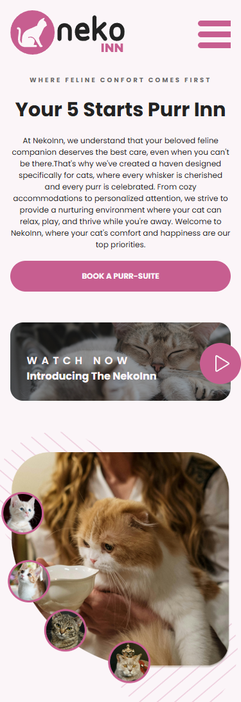
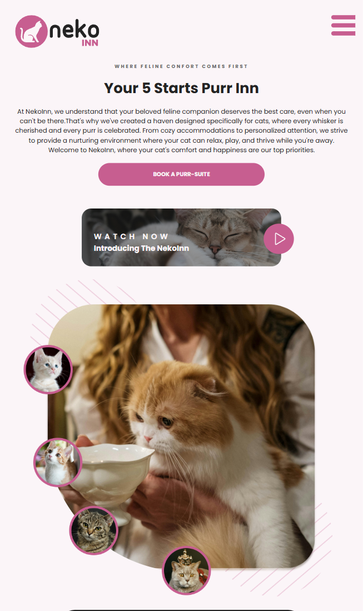
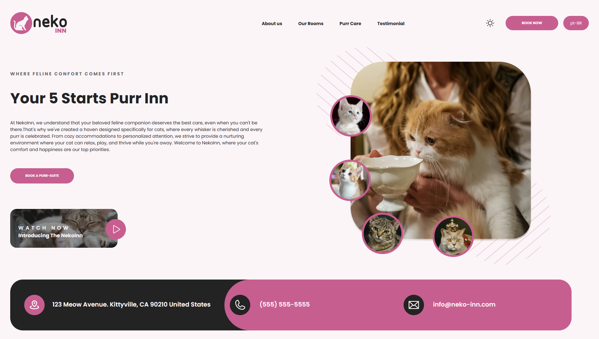

# 🐈 Neko Inn Landing Page

<div>
  
  
  
</div>

Landing Page para **Hospedagem Felina**. Desenvolvida a partir do design UI/UX de <a href="www.figma.com/@zinefalouti?fuid=1136452661324589620">Zine Falouti</a> disponibilizado na <a href="https://www.figma.com/community/file/1363549094164405890/neko-inn-landing-page">comunidade Figma</a>.

| Mobile | Tablet | Desktop | 
|--------|---------|---------|
|  |  |  |

*Imagens meramente ilustrativas, pois ela pode mudar dependendo do tamanho da tela utilizada!

## 🚀 Funcionalidades

**Agendamento automatizado com confirmação via E-mail**: 
- Formulário com validação em tempo real e tratamento de tipos (TypeScript).
- Integração com EmailJS: Envio automático de confirmações para o cliente e para a administração (fluxo duplex).
- Validação de data mínima (maio de 2025).
- Confirmação visual após envio bem-sucedido.


**Internacionalização (i18n) – PT/EN**: 
- Detecção automática do idioma do navegador.
- Conversão inteligente (ex.: "pt" → "pt-BR").
- Troca manual instantânea via react-18next sem recarregar a página (hook useTranslation + método changeLanguage).
- Estrutura modular com namespaces (home/components) e fallback para inglês.

  

**Dark Mode Toggle**: 
- Theming Dinâmico: Troca instantânea de estilos entre lightTheme e darkTheme sem recarregamento.
- Persistência com localStorage: Armazena a preferência do usuário (ex.: "dark" ou "light") no localStorage, mantendo o tema selecionado mesmo após recarregar a página ou fechar/reabrir o navegador.
- Design acessível (contraste ajustado para ambos os temas).
- Enum Tipado: Definição explícita dos temas (light/dark) via ThemeType para segurança de tipos.
- Context API: Estado global gerenciado por ThemeProvider, compartilhando theme, themeData e toggleTheme com toda a aplicação.

    

## 📌 Desafios enfrentados 

**Ser responsivo para todas as possíveis telas (celular, tablet e computador)** não era um requisito no design original deste projeto. O layout inicial não incluía designs para tablet (≥768px) e telas menores de desktop (≥1024px). Decidi expandir a responsividade, adaptando não apenas o layout, mas também a hierarquia de informações para cada dispositivo. Essa abordagem me permitiu aprofundar meus conhecimentos em media queries e repensar a experiência do usuário em diferentes contextos.

**Criar uma lógica para o botão Dark/Light Mode que se adequasse ao meu site** foi mais dificil do que eu imaginava. Por ser minha primeira vez desenvolvendo essa funcionalidade, demorei a entender como implementá-la e como integrá-la ao meu código existente. O principal desafio foi que eu havia codificado sem definir inicialmente as variáveis CSS que seriam alteradas e quais permaneceriam constantes.Para resolver, consultei tutorias no Youtube e analisei projetos similares até conseguir uma aplicação funcional.

**A parte do Book Now/ Reserve Agora** foi uma das mais desafiadoras para mim: não existia uma lógica do que fazer. Originalmente estática, eu poderia mantê-la sem interatividade, seguindo fielmente o protótipo. Porém, ao decidir implementar uma lógica prática, optei por uma solução simples: enviar e-mails de confirmação tanto para o usuário quanto para mim (como administrador) com os dados do agendamento. Utilizei o serviço **EmailJS** que facilitou a integração de envios de e-mail sem necessidade de um servidor backend, criando uma interação entre as partes.

Além disso, **adicionei suporte a múltiplos idiomas (inglês/português)**. Apesar de o projeto ter sido concebido apenas em inglês, aproveitei a oportunidade para estudar internacionalização. Com a biblioteca i18n, explorei padrões de implementação e dinâmicas de troca de idiomas, aprendendo a gerenciar textos dinâmicos e adaptar a experiência localizada do usuário. 

Por fim, este projeto representou um marco no meu crescimento técnico, envolvendo várias "primeiras vezes": temas dinâmicos, integração com serviços externos e internacionalização. Cada desafio foi resolvido com pesquisa, testes e adaptação. 


## 🌐 Deploy no GitHub Pages

O projeto está disponível online via GitHub Pages. Acesse <a href="https://helzaaragao.github.io/NekoInn/">aqui</a> para visualizar.

### 🛠️ Dependências e Versões Utilizadas

**React**: 19.0.0  | **TypeScript**: 5.7.2 | **Vite**: 6.2.0 | **Styled-componets**: 6.1.17 |**Chakra UI**: 3.16.0 | **Phosphor-icons/react**: 2.1.7 | **Emailjs/browser**: 4.4.1 | **i18next**: 25.2.1


### 📂 Como rodar o projeto na sua máquina local

Obs: é preciso já ter instalado o node.js, vscode ou um terminal da sua preferência para executar os comandos!

Clone esse repositório para os seus arquivos:
```
git clone https://github.com/helzaaragao/NekoInn.git
```

Depois, vá até a pasta que você acabou de criar com o comando:

```
cd "NekoInn"
```
E instale todas as depedências e versões utilizadas por esse projeto:

```
npm install
```
Finalmente, rode no seu localhost:
```
npm run dev
```
